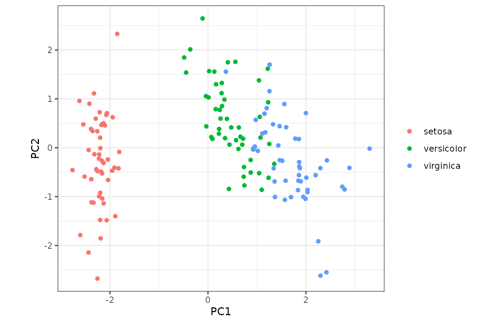

# Using matsindf for principal components analysis

## Introduction

When working with tidy data, it can be challenging to use R operations
that take in matrices. But the functions in `matsindf` make it easier.

## Data

We will illustrate how to handle these cases with `matsindf` functions
by doing principal components analysis (PCA) on the classic Fisher iris
dataset, often used to illustrate PCA. We will be using a “long” input
table, in which each measurement, rather than each flower, is a single
row.

``` r
long_iris <- datasets::iris %>%
  dplyr::mutate(flower = sprintf("flower_%d", 1:nrow(datasets::iris))) %>%
  tidyr::pivot_longer(
    cols = c(-Species, -flower), names_to = "dimension", values_to = "length"
  ) %>%
  dplyr::rename(species = Species) %>%
  dplyr::select(flower, species, dimension, length) %>%
  dplyr::mutate(species = as.character(species))

head(long_iris, n = 5)
#> # A tibble: 5 × 4
#>   flower   species dimension    length
#>   <chr>    <chr>   <chr>         <dbl>
#> 1 flower_1 setosa  Sepal.Length    5.1
#> 2 flower_1 setosa  Sepal.Width     3.5
#> 3 flower_1 setosa  Petal.Length    1.4
#> 4 flower_1 setosa  Petal.Width     0.2
#> 5 flower_2 setosa  Sepal.Length    4.9
```

## Generate PCA results

Using `matsindf`, we can convert to a matrix, apply PCA, and then
convert back to a long format table.

``` r
long_pca_embeddings <- long_iris %>%
  collapse_to_matrices(
    rownames = "flower", colnames = "dimension", matvals = "length"
  ) %>%
  dplyr::transmute(projection = lapply(length, function(mat)
    stats::prcomp(mat, center = TRUE, scale = TRUE)$x
  )) %>%
  expand_to_tidy(
    rownames = "flower", colnames = "component", matvals = "projection"
  )
head(long_pca_embeddings, n = 5)
#>       flower component projection
#> 1   flower_1       PC1 -2.2571412
#> 2  flower_10       PC1 -2.1770349
#> 3 flower_100       PC1  0.2558734
#> 4 flower_101       PC1  1.8384100
#> 5 flower_102       PC1  1.1540156
```

The result are the coordinates of the iris data along the principal
components, as a long format table. We just need to add back the species
column …

``` r
long_pca_withspecies <- long_iris %>%
  dplyr::select(flower, species) %>%
  dplyr::distinct() %>%
  dplyr::left_join(long_pca_embeddings, by = "flower")
head(long_pca_withspecies, n = 5)
#> # A tibble: 5 × 4
#>   flower   species component projection
#>   <chr>    <chr>   <chr>          <dbl>
#> 1 flower_1 setosa  PC1          -2.26  
#> 2 flower_1 setosa  PC2          -0.478 
#> 3 flower_1 setosa  PC3           0.127 
#> 4 flower_1 setosa  PC4          -0.0241
#> 5 flower_2 setosa  PC1          -2.07
```

… followed by the familiar PCA plot.

``` r
long_pca_withspecies %>%
  tidyr::pivot_wider(
    id_cols = c(flower, species), names_from = component,
    values_from = projection
  ) %>%
  ggplot2::ggplot(ggplot2::aes(x = PC1, y = PC2, colour = species)) + 
  ggplot2::geom_point() +
  ggplot2::labs(colour = ggplot2::element_blank()) +
  ggplot2::theme_bw() +
  ggplot2::coord_equal()
#> Warning: `label` cannot be a <ggplot2::element_blank> object.
```



As expected, we see that the distribution of measurements differs across
the three species of iris.

## Conclusion

`matsindf` simplifies tasks that are otherwise much more difficult.
