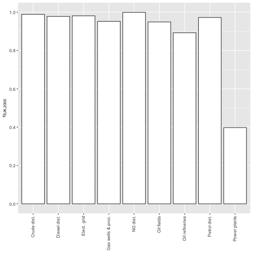

<!-- Establish some helpful LaTeX shortcuts for equations -->
\newcommand{\transpose}[1]{#1^\mathrm{T}}
\newcommand{\inverse}[1]{#1^{\mathrm{-}1}}
\newcommand{\mat}[1]{\mathbf{#1}}
\newcommand{\colvec}[1]{\mathbf{#1}}
\newcommand{\rowvec}[1]{\transpose{\colvec{#1}}}
\newcommand{\inversetranspose}[1]{\transpose{\left( \inverse{\mat{#1}} \right)}}
\newcommand{\transposeinverse}[1]{\inverse{\left( \transpose{\mat{#1}} \right)}}
\newcommand{\hatinv}[1]{\inverse{\widehat{#1}}}


## Introduction

Matrices are important mathematical objects, 
and they often describe networks of flows among nodes. 
Example networks are given in the following table.

| System type   | Flows      | Nodes
|:--------------|:-----------|:---------
| Ecological    | nutrients  | organisms
| Manufacturing | materials  | factories
| Economic      | money      | economic sectors

The power of matrices lies in their ability 
to organize network-wide calculations,
thereby simplifying the work of analysts who study entire systems.

But [wouldn't it be nice](https://en.wikipedia.org/wiki/Wouldn%27t_It_Be_Nice) 
if there were an easy way to create data frames
whose entries were not numbers but entire matrices?
If that were possible, 
matrix algebra could be performed on columns
of similar matrices.

That's the reason for `matsindf`.
It provides functions to convert 
a suitably-formatted 
[tidy](http://tidyr.tidyverse.org/articles/tidy-data.html) 
data frame into a data frame containing a column of matrices.

Furthermore, `matsbyname` is a sister package that ...

* ... provides matrix algebra functions that respect names of matrix rows and columns
(`dimnames` in `R`)
to free the analyst from the task of aligning rows and columns of 
operands (matrices) passed to matrix algebra functions and
* ... allows matrix algebra to be conducted within data frames using 
[dplyr](http://dplyr.tidyverse.org),
[tidyr](http://tidyr.tidyverse.org), 
and other
[tidyverse](http://www.tidyverse.org)
functions.

When used together, `matsindf` and `matsbyname`
allow analysts to wield simultaneously the power of both 
[matrix mathematics](https://en.wikipedia.org/wiki/Matrix_(mathematics))
and 
[tidyverse](http://www.tidyverse.org) 
functional programming.

This vignette demonstrates the use of these packages
and suggests a workflow to accomplish
sophisticated analyses using *matrices in data frames* (`matsindf`).


## Data: `UKEnergy2000`

To demonstrate the use of `matsindf` functions,
consider a network of energy flows from the environment,
through transformation and distribution processes, and, ultimately,
to final demand.
Such energy flow networks are called energy conversion chains (ECCs), and
this example is based on an approximation to a portion of the UK's ECC circa 2000.
(Note that these data are to be used for demonstration purposes only and
have been rounded to 1--2 significant digits.)
These example data first appeared in Figures 3 and 4 
of Heun, Owen, and Brockway [-@Heun:2018].


```r
head(UKEnergy2000, 2)
#>   Country Year Ledger.side      Flow.aggregation.point              Flow
#> 1      GB 2000      Supply Total primary energy supply Resources - Crude
#> 2      GB 2000      Supply Total primary energy supply    Resources - NG
#>   Product E.ktoe
#> 1   Crude  50000
#> 2      NG  43000
```

`Country` and `Year` contain only one value each, 
`GB` and `2000` respectively.
Following conventions of the [International Energy Agency](http://www.iea.org)'s 
[energy balance tables](https://www.iea.org/data-and-statistics/data-tables), 

* `Ledger.side` indicates `Supply` or `Consumption`;
* `Flow.aggregation.point` indicates how data are to be aggregated;
* `Flow` indicates the industry, machine, or final demand sector for this flow;
* `Product` indicates the energy carrier for this flow; and 
* `E.ktoe` gives the magnitude of this flow 
in [units](https://www.eia.gov/energyexplained/units-and-calculators/energy-conversion-calculators.php) 
of kilotons of oil equivalent (ktoe).

Each flow is its own observation 
(its own row)
in the `UKEnergy2000` data frame,
making it [tidy](http://tidyr.tidyverse.org/articles/tidy-data.html).

The remainder of this vignette demonstrates an analysis conducted using the
`UKEnergy2000` data frame as a basis. 
It:

* shows how to *collapse* and spread 
the data into appropriate matrices stored in columns of a data frame,
* demonstrates analyzing the matrices with `matsbyname` functions,
* illustrates *expand*ing the matrices back into a tidy data frame, and
* uses [ggplot](http://ggplot2.tidyverse.org) to graph the results.


## Suggested workflow

### Prepare for *collapse*

The `EnergyUK2000` data frame is similar to 
"cleaned" data from an external source: 
there are no missing entries, and 
it is [tidy](http://tidyr.tidyverse.org/articles/tidy-data.html).
But the data are not organized as matrices,
and additional metadata is needed.

The `collapse_to_matrices` function converts a tidy data frame into a 
`matsindf` data frame using using information within the tidy data frame.
So the first task is to prepare for *collapse* by adding metadata columns.

`collapse_to_matrices` needs the following information:

| argument to `collapse_to_matrices`   | identifies
|--------------------------------------------:|:--------------------------------
| `matnames`                           | Name of the input column of matrix names          
| `values`                             | Name of the input column of matrix entries        
| `rownames`                           | Name of the input column of matrix row names      
| `colnames`                           | Name of the input column of matrix column name    
| `rowtypes`                           | Optional name of the input column of matrix row types      
| `coltypes`                           | Optional name of the input column of matrix column types   

The following code gives the approach to adding metadata,
appropriate for this application, 
relying on `Ledger.side`, the sign of `E.ktoe`,
and knowledge about the rows and columns for each matrix.
Each type of network will have its own algorithm for identifying 
row names, column names, row types, and column types
in a tidy data frame.


```r
UKEnergy2000_with_metadata <- UKEnergy2000 %>% 
  # Add a column indicating the matrix in which this entry belongs (U, V, or Y).
  matsindf:::add_UKEnergy2000_matnames(.) %>% 
  # Add columns for row names, column names, row types, and column types.
  matsindf:::add_UKEnergy2000_row_col_meta(.) %>% 
  mutate(
    # Eliminate columns we no longer need
    Ledger.side = NULL,
    Flow.aggregation.point = NULL,
    Flow = NULL,
    Product = NULL, 
    # Ensure that all energy values are positive, as required for analysis.
    E.ktoe = abs(E.ktoe)
  )
head(UKEnergy2000_with_metadata, 2)
#>   Country Year E.ktoe matname           rowname colname  rowtype coltype
#> 1      GB 2000  50000       V Resources - Crude   Crude Industry Product
#> 2      GB 2000  43000       V    Resources - NG      NG Industry Product
```


### Collapse

With the metadata now in place, 
`UKEnergy2000_with_metadata` can be collapsed to a `matsindf` data frame
by the `collapse_to_matrices` function.
Much like `dplyr::summarise`,
`collapse_to_matrices` relies on grouping to indicate which 
rows of the tidy data frame belong to which matrices.
The usual approach is to `tidyr::group_by` 
the `matnames` column and any other columns to be preserved in the output,
in this case `Country` and `Year`.


```r
EnergyMats_2000 <- UKEnergy2000_with_metadata %>% 
  group_by(Country, Year, matname) %>% 
  collapse_to_matrices(matnames = "matname", matvals = "E.ktoe",
                       rownames = "rowname", colnames = "colname", 
                       rowtypes = "rowtype", coltypes = "coltype") %>% 
  rename(matrix.name = matname, matrix = E.ktoe)

# The remaining columns are Country, Year, matrix.name, and matrix
glimpse(EnergyMats_2000)
#> Observations: 3
#> Variables: 4
#> $ Country     <chr> "GB", "GB", "GB"
#> $ Year        <int> 2000, 2000, 2000
#> $ matrix.name <chr> "U", "V", "Y"
#> $ matrix      <list> [<matrix[11 x 9]>, <matrix[11 x 12]>, <matrix[4 x 2]>]

# To access one of the matrices, try one of these approaches:
(EnergyMats_2000 %>% filter(matrix.name == "U"))[["matrix"]] # The U matrix
#> [[1]]
#>                Crude dist. Diesel dist. Elect. grid Gas wells & proc. NG dist.
#> Crude                    0            0           0                 0        0
#> Crude - Dist.            0            0           0                 0        0
#> Crude - Fields       47500            0           0                 0        0
#> Diesel                   0        15500           0                 0        0
#> Diesel - Dist.          25            0           0                50       25
#> Elect                    0            0        6400                 0        0
#> Elect - Grid            25            0           0                25       25
#> NG                       0            0           0             43000        0
#> NG - Dist.               0            0           0                 0        0
#> NG - Wells               0            0           0                 0    41000
#> Petrol                   0            0           0                 0        0
#>                Oil fields Oil refineries Petrol dist. Power plants
#> Crude               50000              0            0            0
#> Crude - Dist.           0          47000            0            0
#> Crude - Fields          0              0            0            0
#> Diesel                  0              0            0            0
#> Diesel - Dist.         50              0          250            0
#> Elect                   0              0            0            0
#> Elect - Grid           25             75            0          100
#> NG                      0              0            0            0
#> NG - Dist.              0              0            0        16000
#> NG - Wells              0              0            0            0
#> Petrol                  0              0        26500            0
#> attr(,"rowtype")
#> [1] "Product"
#> attr(,"coltype")
#> [1] "Industry"

EnergyMats_2000$matrix[[2]] # The V matrix
#>                   Crude Crude - Dist. Crude - Fields Diesel Diesel - Dist.
#> Crude dist.           0         47000              0      0              0
#> Diesel dist.          0             0              0      0          15150
#> Elect. grid           0             0              0      0              0
#> Gas wells & proc.     0             0              0      0              0
#> NG dist.              0             0              0      0              0
#> Oil fields            0             0          47500      0              0
#> Oil refineries        0             0              0  15500              0
#> Petrol dist.          0             0              0      0              0
#> Power plants          0             0              0      0              0
#> Resources - Crude 50000             0              0      0              0
#> Resources - NG        0             0              0      0              0
#>                   Elect Elect - Grid    NG NG - Dist. NG - Wells Petrol
#> Crude dist.           0            0     0          0          0      0
#> Diesel dist.          0            0     0          0          0      0
#> Elect. grid           0         6275     0          0          0      0
#> Gas wells & proc.     0            0     0          0      41000      0
#> NG dist.              0            0     0      41000          0      0
#> Oil fields            0            0     0          0          0      0
#> Oil refineries        0            0     0          0          0  26500
#> Petrol dist.          0            0     0          0          0      0
#> Power plants       6400            0     0          0          0      0
#> Resources - Crude     0            0     0          0          0      0
#> Resources - NG        0            0 43000          0          0      0
#>                   Petrol - Dist.
#> Crude dist.                    0
#> Diesel dist.                   0
#> Elect. grid                    0
#> Gas wells & proc.              0
#> NG dist.                       0
#> Oil fields                     0
#> Oil refineries                 0
#> Petrol dist.               26000
#> Power plants                   0
#> Resources - Crude              0
#> Resources - NG                 0
#> attr(,"rowtype")
#> [1] "Industry"
#> attr(,"coltype")
#> [1] "Product"

EnergyMats_2000$matrix[[3]] # The Y matrix
#>                Residential Transport
#> Diesel - Dist.           0     14750
#> Elect - Grid          6000         0
#> NG - Dist.           25000         0
#> Petrol - Dist.           0     26000
#> attr(,"rowtype")
#> [1] "Product"
#> attr(,"coltype")
#> [1] "Sector"
```


### Duplicate (for purposes of illustration)

Larger studies will include data for multiple countries and years. 
The ECC data from UK in year `2000` can be duplicated 
for `2001` and 
for a fictitious country `AB`.
Although the data are unchanged, 
the additional rows serve to illustrate the
functional programming aspects 
of the `matsindf` and `matsbyname` packages.


```r
Energy <- EnergyMats_2000 %>% 
  # Create rows for a fictitious country "AB".
  # Although the rows for "AB" are same as the "GB" rows,
  # they serve to illustrate functional programming with matsindf.
  rbind(EnergyMats_2000 %>% mutate(Country = "AB")) %>% 
  spread(key = Year, value = matrix) %>% 
  mutate(
    # Create a column for a second year (2001).
    `2001` = `2000`
  ) %>% 
  gather(key = Year, value = matrix, `2000`, `2001`) %>% 
  # Now spread to put each matrix in a column.
  spread(key = matrix.name, value = matrix)

glimpse(Energy)
#> Observations: 4
#> Variables: 5
#> $ Country <chr> "AB", "AB", "GB", "GB"
#> $ Year    <chr> "2000", "2001", "2000", "2001"
#> $ U       <list> [<matrix[11 x 9]>, <matrix[11 x 9]>, <matrix[11 x 9]>, <matr…
#> $ V       <list> [<matrix[11 x 12]>, <matrix[11 x 12]>, <matrix[11 x 12]>, <m…
#> $ Y       <list> [<matrix[4 x 2]>, <matrix[4 x 2]>, <matrix[4 x 2]>, <matrix[…
```


### Verify data

An important step in any analysis is data verification.
For an ECC analysis, it is important to verify that energy is conserved
(i.e., energy is in balance) 
across all industries.
Equations 1 and 2 in Heun, Owen, and Brockway [-@Heun:2018]
show that energy balance is verified by 

$$\mat{W} = \transpose{\mat{V}} - \mat{U},$$

and

$$\mat{W}\colvec{i} - \mat{Y}\colvec{i} = \colvec{0}.$$

Energy balance verification can be implemented with `matsbyname` functions
and `tidyverse` functional programming:


```r
Check <- Energy %>% 
  mutate(
    W = difference_byname(transpose_byname(V), U),
    # Need to change column name and type on y so it can be subtracted from row sums of W
    err = difference_byname(rowsums_byname(W), 
                            rowsums_byname(Y) %>% 
                              setcolnames_byname("Industry") %>% setcoltype("Industry")),
    EBalOK = iszero_byname(err)
  )
Check %>% select(Country, Year, EBalOK)
#>   Country Year EBalOK
#> 1      AB 2000   TRUE
#> 2      AB 2001   TRUE
#> 3      GB 2000   TRUE
#> 4      GB 2001   TRUE
all(Check$EBalOK %>% as.logical())
#> [1] TRUE
```

This example demonstrates that energy balance can be verified for *all* combinations
of Country and Year with a few lines of code.
In fact, the exact same code can be applied to the `Energy` data frame, 
regardless of the number of rows in it.

Secure in the knowledge that energy is conserved across all ECCs
in the `Energy` data frame, 
other analyses can proceed.


### Efficiencies

To further illustrate the power of `matsbyname` functions 
in the context of `matsindf`,
consider the calculation of the efficiency of every industry in the ECC as column vector $\eta$ 
as shown by Equation 11 of Heun, Owen, and Brockway [-@Heun:2018].

$$\colvec{g} = \mat{V}\colvec{i}$$

$$\colvec{\eta} = \hatinv{\transpose{\mat{U}} \colvec{i}} \colvec{g}$$


```r
Etas <- Energy %>% 
  mutate(
    g = rowsums_byname(V),
    eta = transpose_byname(U) %>% rowsums_byname() %>% 
      hatize_byname() %>% invert_byname() %>% 
      matrixproduct_byname(g) %>% 
      setcolnames_byname("eta") %>% setcoltype("Efficiency")
  ) %>% 
  select(Country, Year, eta)

Etas$eta[[1]]
#>                         eta
#> Crude dist.       0.9884332
#> Diesel dist.      0.9774194
#> Elect. grid       0.9804688
#> Gas wells & proc. 0.9518282
#> NG dist.          0.9987820
#> Oil fields        0.9485771
#> Oil refineries    0.8921933
#> Petrol dist.      0.9719626
#> Power plants      0.3975155
#> attr(,"rowtype")
#> [1] "Industry"
#> attr(,"coltype")
#> [1] "Efficiency"
```

Note that only a few lines of code are required to perform the same series of 
matrix operations on every combination of `Country` and `Year`.
In fact, the same code will be used to calculate the efficiency of 
any number of industries in any number of countries and years!


### Expand

Plotting values from a `matsindf` data frame
can be accomplished by *expand*ing the matrices 
of the `matsindf` data frame (in this example, `Etas`)
back out to a tidy data frame.
*Expand*ing is the reverse of *collapse*-ing, and 
the following information must be supplied to the 
`expand_to_tidy` function:

| argument to `expand_to_tidy`         | identifies
|--------------------------------------------:|:--------------------------------
| `matnames`                           | Name of the input column of matrix names          
| `matvals`                            | Name of the input column of matrices to be expanded
| `rownames`                           | Name of the output column of matrix row names      
| `colnames`                           | Name of the output column of matrix column name    
| `rowtypes`                           | Optional name of the output column of matrix row types      
| `coltypes`                           | Optional name of the output column of matrix column types   
| `drop`                               | Optional value to be dropped from output (often 0)

Prior to `expand`ing, it is usually 
necessary to `gather` columns of matrices.


```r
etas_forgraphing <- Etas %>% 
  gather(key = matrix.names, value = matrix, eta) %>% 
  expand_to_tidy(matnames = "matrix.names", matvals = "matrix", 
                 rownames = "Industry", colnames = "etas", 
                 rowtypes = "rowtype", coltypes = "Efficiencies") %>% 
  mutate(
    # Eliminate columns we no longer need.
    matrix.names = NULL,
    etas = NULL, 
    rowtype = NULL, 
    Efficiencies = NULL
  ) %>% 
  rename(
    eta = matrix
  )

# Compare to Figure 8 of Heun, Owen, and Brockway (2018)
etas_forgraphing %>% filter(Country == "GB", Year == 2000)
#> # A tibble: 9 x 4
#>   Country Year  Industry            eta
#>   <chr>   <chr> <chr>             <dbl>
#> 1 GB      2000  Crude dist.       0.988
#> 2 GB      2000  Diesel dist.      0.977
#> 3 GB      2000  Elect. grid       0.980
#> 4 GB      2000  Gas wells & proc. 0.952
#> 5 GB      2000  NG dist.          0.999
#> 6 GB      2000  Oil fields        0.949
#> 7 GB      2000  Oil refineries    0.892
#> 8 GB      2000  Petrol dist.      0.972
#> 9 GB      2000  Power plants      0.398
```

`etas_forgraphing` is a data frame of efficiencies, 
one for each Country, Year, and Industry, 
in a format that is amenable to plotting
with packages such as [ggplot](http://ggplot2.tidyverse.org).


### Report

The following code creates a bar graph of efficiency results for the UK in 2000:


```r
etas_UK_2000 <- etas_forgraphing %>% filter(Country == "GB", Year == 2000) 

etas_UK_2000 %>% 
  ggplot(mapping = aes_string(x = "Industry", y = "eta", 
                              fill = "Industry", colour = "Industry")) + 
  geom_bar(stat = "identity") +
  labs(x = NULL, y = expression(eta[UK*","*2000]), fill = NULL) + 
  scale_y_continuous(breaks = seq(0, 1, by = 0.2)) +
  scale_fill_manual(values = rep("white", nrow(etas_UK_2000))) +
  scale_colour_manual(values = rep("gray20", nrow(etas_UK_2000))) + 
  guides(fill = FALSE, colour = FALSE) +
  theme(axis.text.x = element_text(angle = 90, vjust = 0.4, hjust = 1))
```




## Conclusion

This vignette demonstrated the use of the `matsindf` and `matsbyname` packages
and suggested a workflow to accomplish
sophisticated analyses using *matrices in data frames* (`matsindf`).

The workflow is as follows:

* Reshape data into a tidy data frame with columns for
matrix name, element value,
row name, column name, 
row type, and column type,
similar to `UKEnergy2000` above.
* Use `collapse_to_matrices`
to create a data frame of matrices with columns for matrix names and 
matrices themselves,
similar to `EnergyMats_2000` above.
* `tidyr::spread` the matrices to obtain a data frame with columns for each matrix,
similar to `Energy` above.
* Validate the data, similar to `Check` above.
* Perform matrix algebra operations on the columns of matrices
using `matsbyname` functions in a manner similar to the process of generating
the `Etas` data frame above.
* `tidyr::gather` the columns to obtain a tidy data frame of matrices.
* Use `expand_to_tidy` to create a tidy data frame of matrix elements,
similar to `etas_forgraphing` above.
* Plot and report results as demonstrated by the graph above.

Data frames of matrices, 
such as those created by `matsindf`,
are like magic spreadsheets 
in which single cells contain entire matrices.
With this data structure, 
analysts can wield simultaneously the power of both 
[matrix mathematics](https://en.wikipedia.org/wiki/Matrix_(mathematics)) and 
[tidyverse](http://www.tidyverse.org) 
functional programming.


## References
